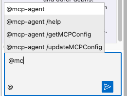
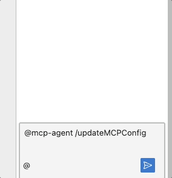
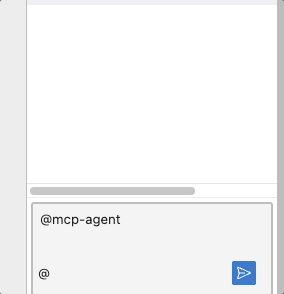

# NBI MCP Agent

[A Jupyter Notebook Intelligence ](https://github.com/notebook-intelligence/notebook-intelligence) MCP Agent extension

- Adds @mcp-agent participant in the nbi
- Available commands with @mcp-agent
- @mcp-agent /help 
- @mcp-agent /getMCPConfig To get current mcp server config
- @mcp-agent /updateMCPConfig To update the mcp server config



# Update the server config path 


The server json file is format should be like 

```
{
  "mcpServers": {
    "weather": {
      "command": "/Users/user/.local/bin/uv",
      "args": [
        "--directory",
        "/Users/mcp/weather",
        "run",
        "weather.py"
      ]
    },
    "mcp-hn": {
      "command": "uv",
      "args": [
        "--directory",
        "/Users/mcp/mcp-hn-main/",
        "run",
        "mcp-hn"
      ]
    }
  }
}

```

# Calling MCP Tools


# References
Extensions code is inspired or taken from below sources
- [Introducing Notebook Intelligence!](https://blog.jupyter.org/introducing-notebook-intelligence-3648c306b91a)
- [Building AI Agents for JupyterLab using Notebook Intelligence](https://blog.jupyter.org/building-ai-agents-for-jupyterlab-using-notebook-intelligence-0515d4c41a61)
- [notebook-intelligence](https://github.com/notebook-intelligence/notebook-intelligence)
- [Building AI Extensions for JupyterLab](https://notebook-intelligence.github.io/notebook-intelligence/blog/2025/02/05/building-ai-extensions-for-jupyterlab.html)
- [MCP Simple Chatbot](https://github.com/modelcontextprotocol/python-sdk/tree/main/examples/clients/simple-chatbot)
- [Chatbot example: clean up servers in correct order](https://github.com/modelcontextprotocol/python-sdk/pull/353)

## License

This project is licensed under the MIT License - see the LICENSE file for details.
